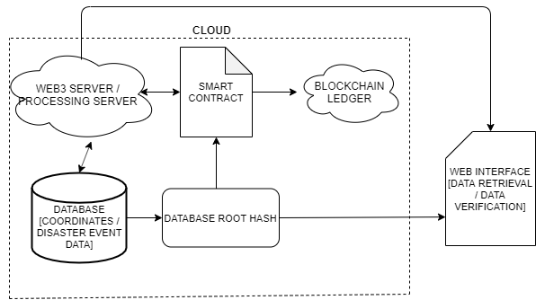
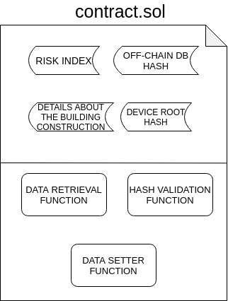
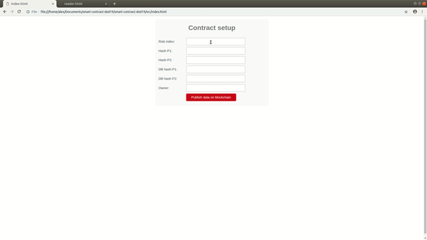

# Smart contract of "Land Property Data Logging on Blockchain Ledger" and example running on eth

## Description

#### Online repo of Smart contract used in paper "Land Property Data Logging on Blockchain Ledger" presented in 4th International Conference On Dynamics Of Disasters.
On this executable example you will quickly run a web interace for the blockchain example application.The functional diagram of the example is seen in the figure below.



The web3 server along with the blockchain ledger is simulated by running ganache with a pre-built blockchain. The database and code for the database root hash is not implemented in this example and instead it's left upon the user to enter a hash.
The smart contract is impemented and can be found at contracts > contract.sol. A quick review of the smart contract is seen in the figure below.



As discussed in the paper, the contract saves the Risk Index generated by risk evaluation algorithms, the root hash of the off-chain database and the root hash of the data the device has recorded. Moreover the name of the property owner along with construction details is recorded on the chain.

## Installation

#### > Automatic installation 
##### Copy and paste the following commands in a bash shell. You will be prompted to type the root password
```sh
git clone https://github.com/alex-z-charalampidis/smart-contract-dod19.git && cd smart-contract-dod19 && sudo chmod 755 setup_contract.sh && sudo ./setup_contract.sh
```
#### > Manual installation 
##### **In order to run the example the following 3 packages need to be installed in the host system:** 
##### 1) NodeJS 
```s
$ sudo apt-get update -y
$ sudo apt-get install nodejs -y
```
##### 2) Truffle 
```sh
$ npm install -g truffle
```
##### 3) Ganache 
```sh
$ npm install -g ganache-cli
```

## User guide 

##### 1) Open a new terminal and clone this git in a new file using the commands below
```sh
$ git clone https://github.com/alex-z-charalampidis/smart-contract-dod19.git && cd smart-contract-dod19
```
##### 2) Run the ganache-cli which is provided with a prebuilt sample blockchain in the chaindb file
```sh
$ ganache-cli --db chaindb/ 
```

##### 3) Open the file index.html located in the "src" file using your browser or on a new terminal within the same directory run
```sh
$ google-chrome ./src/index.html
```
##### 4) Enter your variables and click "Publish data on blockchain". Then right click on white space and select "Inspect". Afterwards copy the transaction hash as seen on the right of the screen.
##### 5) Open the file index.html located in the "src" file using your browser or run on a new terminal within the same directory
```sh
$ google-chrome ./src/reader.html
```
##### 6) Enter your transaction hash and click "Publish data on blockchain". Et voila! The data is fetched from the blockchain and displayed on your screen


