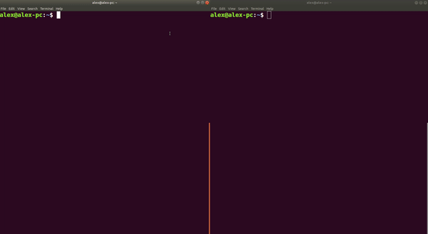

# Smart contract of "Land Property Data Logging on Blockchain Ledger"
## Description
---
##### Online repo of Smart contract used in paper "Land Property Data Logging on Blockchain Ledger" presented in 4th International Conference On Dynamics Of Disasters..

## Installation
---

#### > Automatic installation 
##### Copy and paste the following commands in a bash shell. You will be prompted to type the root password
```sh
git clone https://github.com/alex-z-charalampidis/smart-contract-dod19.git && cd smart-contract-dod19 && sudo chmod 755 setup_contract.sh && sudo ./setup_contract.sh
```
#### > Manual installation 
##### **In order to run the example the following 3 need to be installed in the host system:** 
##### 1) NodeJS 
```s
$ sudo apt-get update 
$ sudo apt-get install nodejs
```
##### 2) Truffle 
```sh
$ npm install -g truffle
```
##### 3) Ganache 
```sh
$ npm install -g ganache-cli
```

## User guide 
---
##### 1) Open a new terminal and clone this git in a new file using the commands below
```sh
$ git clone https://github.com/alex-z-charalampidis/smart-contract-dod19.git && cd smart-contract-dod19
```
##### 2) Run the ganache-cli which is provided with a prebuilt sample blockchain in the chaindb file
```sh
$ ganache-cli --db chaindb/ 
```
##### 3) Open the file index.html located in the "src" file using your browser or on a new terminal within the same directory run
```sh
$ suitable-browser ./src/index.html
```

